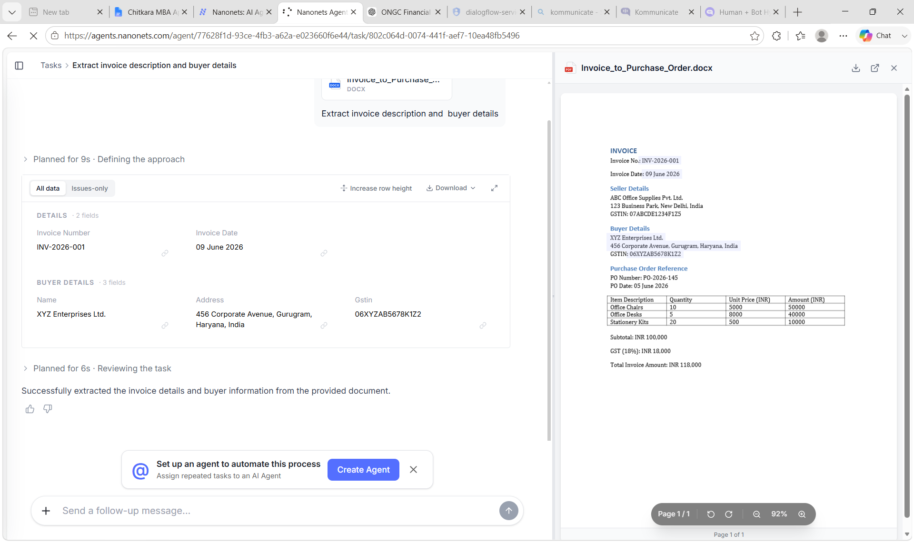

# Invoice-to-Purchase-Order Automation using Nanonets

## 📌 Overview
This project automates the conversion of invoices into Purchase Orders (POs) using Nanonets OCR and AI-powered document processing. The workflow extracts invoice data, validates key information, and generates structured purchase order details, reducing manual effort and improving operational efficiency.

## 🚀 Features
- Automated invoice data extraction
- OCR-based document processing with Nanonets
- Purchase Order generation from invoice data
- Reduced manual data entry
- Improved accuracy and processing speed
- Scalable workflow automation

## 🏗️ Workflow
1. Upload an invoice document.
2. Extract invoice details using Nanonets OCR.
3. Validate extracted information.
4. Generate Purchase Order data automatically.
5. Store or forward processed information to downstream systems.

## 📷 Workflow Diagram

## 🛠️ Technologies Used
- Nanonets OCR
- AI Document Processing
- Workflow Automation
- Purchase Order Management

## 🎯 Benefits
- Faster invoice processing
- Reduced human errors
- Improved operational efficiency
- Better compliance and audit tracking
- Lower processing costs

## 👤 Author
**Aakash Malhotra**

## 📄 License
This project is licensed under the MIT License.
